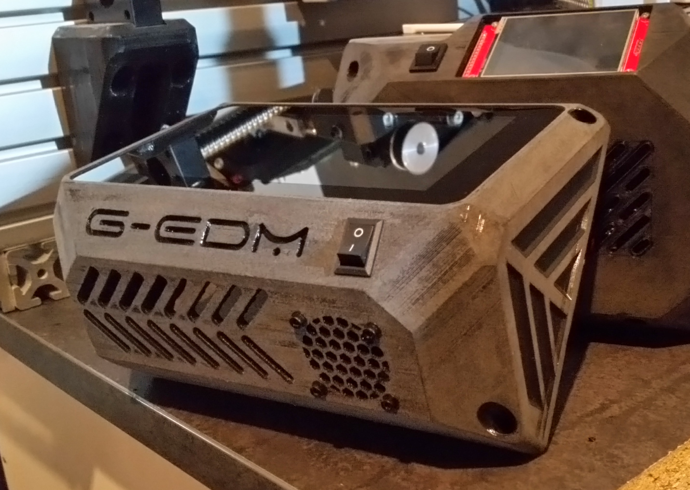

This is the new EVO IV Panel used to run the upcoming firmware that 
has the UI on a dedicated waveshare 7" display.
  
ESP32-S3 7" Display 800x480:
https://www.waveshare.com/esp32-s3-touch-lcd-7.htm?&aff_id=128932
  
The code is not ready yet but will be published as soon as possible.

  

  
